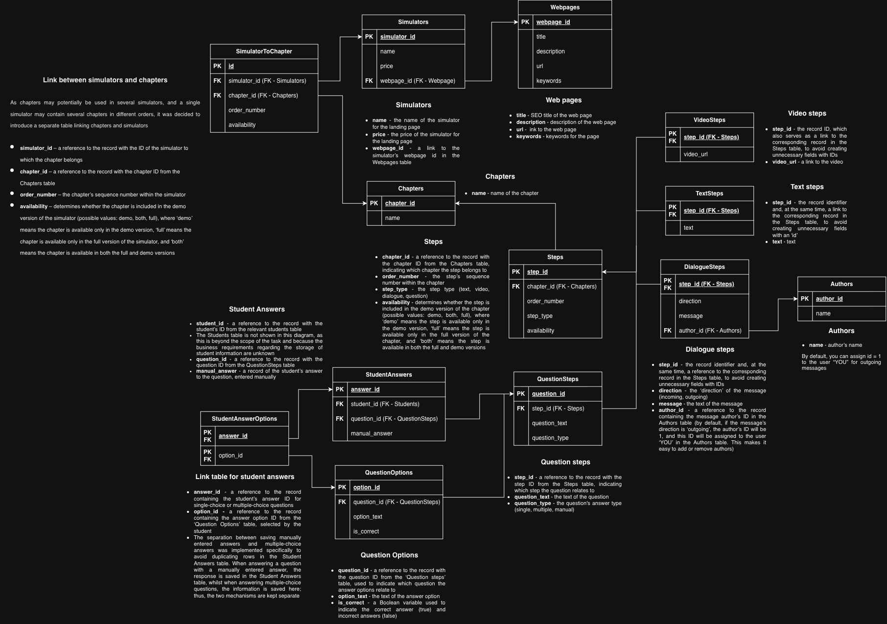
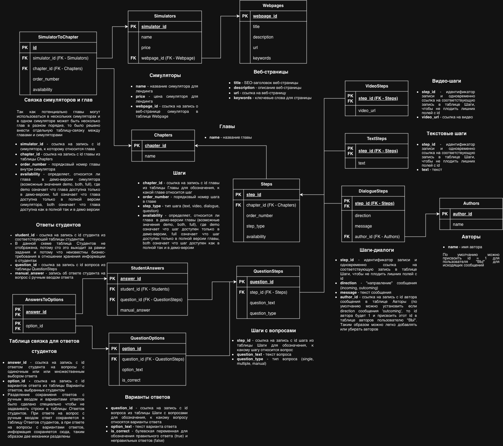

# LMS Database Design

Relational database design for a Learning Management System (LMS) for educational simulators.

This project was completed as part of an SQL and database design course. The task was to translate a set of business requirements for an LMS into a relational database schema suitable for use by a backend API and future analytics.

## Project scope

The schema is designed to support:

- educational simulators and their web pages
- SEO information for web pages
- reusable chapters across multiple simulators
- ordered chapters within simulators
- demo and full versions of simulator content
- chapters consisting of ordered steps
- different types of learning content
- text, video, dialogue, and question steps
- dialogue authors and incoming/outgoing messages
- single-choice, multiple-choice, and manual-input questions
- question answer options and correct answers
- storage of student answers

The planned standalone Tests functionality and the broader student-management system are outside the scope of the current project.

## Schema

### English version

### Russian version

## Key design decisions

### Separate Webpages entity

Web page information is stored separately from simulators because not every web page belongs to a simulator. The same structure can therefore be used for simulator pages and other types of content, such as future blog pages.

SEO-related attributes are stored at the web page level because they describe the page rather than the simulator itself.

### Reusable chapters

Chapters are modeled as independent entities and connected to simulators through `SimulatorToChapter`.

This allows the same chapter to be included in multiple simulators without duplicating its data. For example, a chapter covering a common topic can be reused in both a Data Analysis simulator and a Backend Development simulator.

`SimulatorToChapter` also stores attributes that describe the relationship between a simulator and a chapter:

- `order_number` determines the chapter's position within the simulator
- `availability` determines whether the chapter is available in the demo version, the full version, or both

### Steps belong to chapters

Unlike chapters, Steps are associated directly with a specific Chapter.

The `Steps` table stores attributes common to all step types:

- `step_id`
- `chapter_id`
- `order_number`
- `step_type`
- `availability`

The order and availability of a Step are therefore stored together with the Step itself because, in this design, a Step belongs to one particular Chapter.

### Extensible step architecture

Different types of Steps require different data, so type-specific information is stored in separate tables:

- `TextSteps`
- `VideoSteps`
- `DialogueSteps`
- `QuestionSteps`

The generic `Steps` table contains only attributes shared by all step types.

This avoids a single table containing many irrelevant nullable columns and allows additional step types to be introduced without redesigning the existing structure.

### Dialogue steps

Dialogue steps store the message, its direction, and an optional author.

Incoming messages have an associated author, while outgoing messages can use the default author "You". Additional authors can be added through the `Authors` table.

### Questions and answer options

Questions are represented separately from their answer options.

`QuestionSteps` stores the question text and question type, while `QuestionOptions` stores the possible answers and whether each option is correct.

This structure supports:

- single-choice questions
- multiple-choice questions with several correct answers
- manual-input questions with no predefined options

### Student answers

Student responses are separated from the question's correct answers.

`QuestionOptions.is_correct` represents the answer key, while `StudentAnswers` and `AnswersToOptions` represent what the student actually submitted.

This allows the database to preserve incorrect selections as well as correct ones and supports questions where a student can select multiple options.

For manually entered answers, the response is stored directly in `StudentAnswers.manual_answer`.

## Design principles

The schema was designed with the following principles in mind:

- normalize data and avoid unnecessary duplication
- use explicit primary and foreign key relationships
- avoid unnecessary many-to-many relationships
- store relationship-specific attributes in relationship tables
- keep common and type-specific attributes separate
- allow the content model to be extended in the future
- avoid implementing functionality outside the current requirements
- keep the resulting structure convenient for both application queries and analytics

## Project context

The database design is based on a business requirements document describing an LMS for educational simulators. The original requirements were provided in Russian; an English version of the schema was created for portfolio presentation.